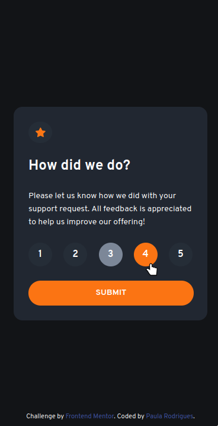
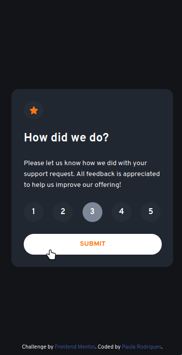
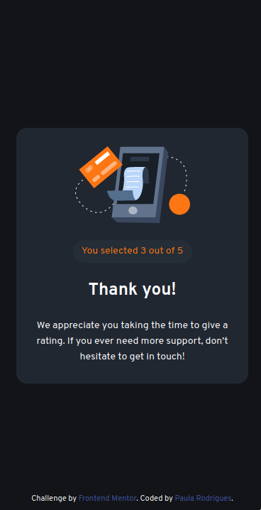
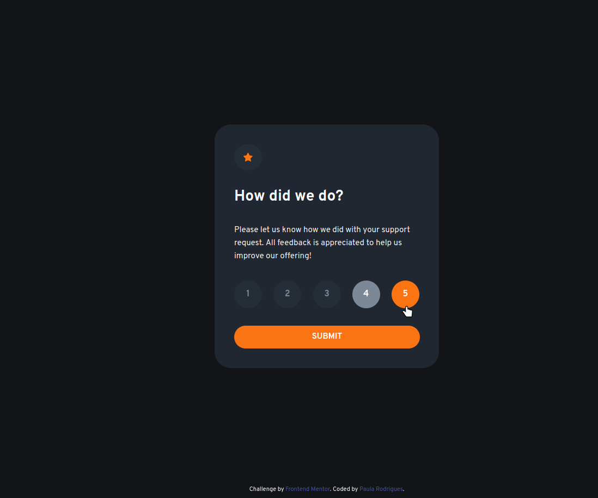
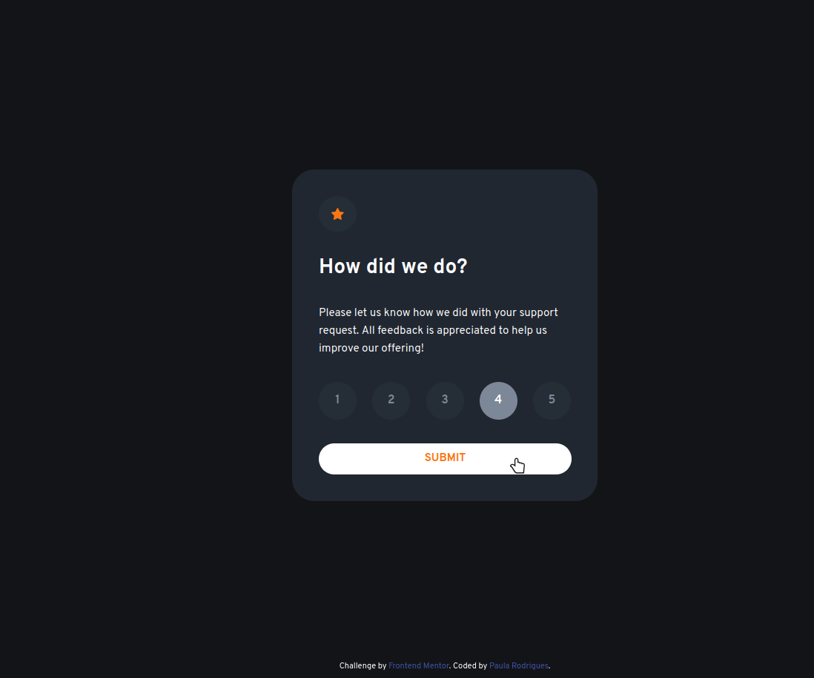
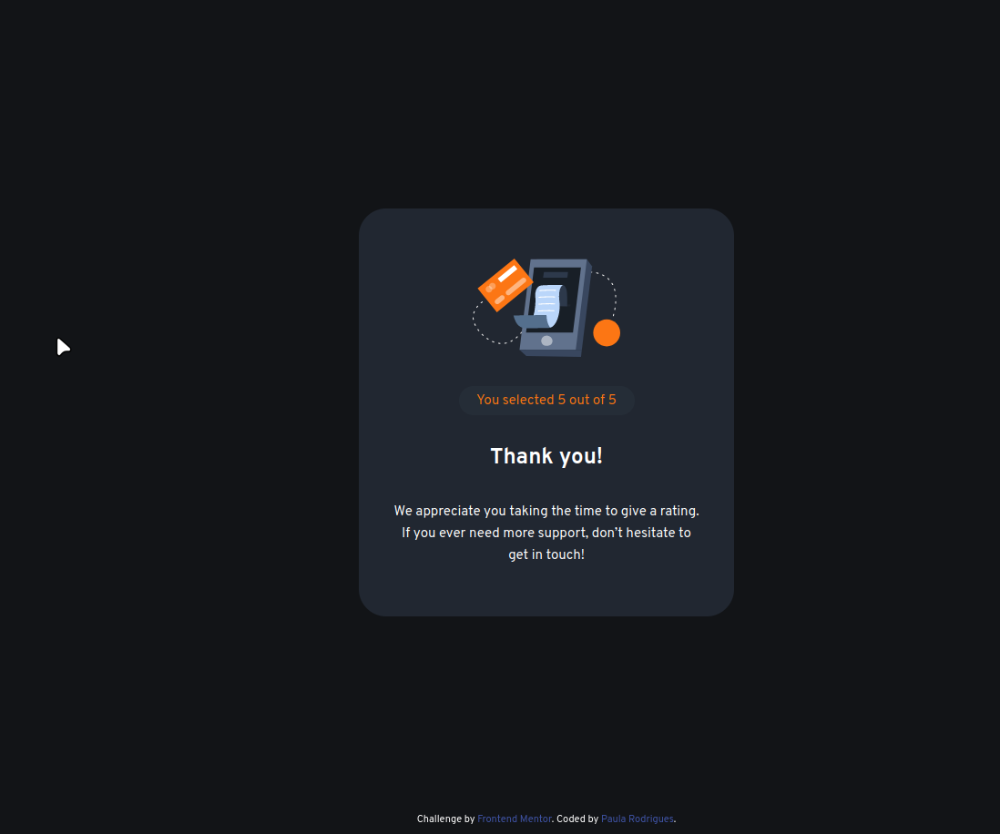

# Frontend Mentor - Product preview card component solution

This is a solution to the [Interactive rating component challenge on Frontend Mentor](https://www.frontendmentor.io/challenges/interactive-rating-component-koxpeBUmI).

## Table of contents

- [Overview](#overview)
    - [Screenshot](#screenshots)
    - [Links](#links)
        - [Mobile View](#mobile-view)
        - [Desktop View](#desktop-view)
        - [Desktop View](#desktop-view-w-hover)
    - [Built with](#built-with)
- [Author](#author)

## Overview
For this project I had to use the Figma file.

### Screenshots

#### Mobile View

#### Desktop View

### Links

- Solution URL: [Solution](https://www.frontendmentor.io/challenges/interactive-rating-component-koxpeBUmI/hub/responsive-rating-component-w-flexbox-and-vanilla-js-u_44bbwgSU)
- Live Site URL: [Live URL](https://interactive-rating-component.paulaabro.com)

### Built with

- Semantic HTML5 markup
- Flexbox
- Mobile-first workflow
- Media Queries
- Figma
- Vanilla JS

## Author

- Frontend Mentor - [@pullynnhah](https://www.frontendmentor.io/profile/pullynnhah)
